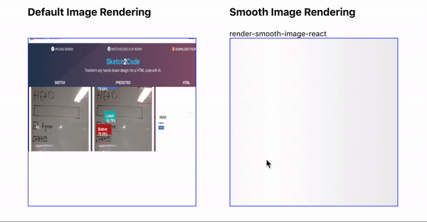

Improve your web apps UX by enhancing image render with React's `onLoad` event and simple SCSS.

Let's cut to the chase. The GIF below shows what we are going to achieve by the end of this post.



Here is the Completed Component Gist - [RenderSmoothImage](https://gist.github.com/KRRISH96/48b4200bc73f1071da804911c05ea373).

I have published this as an `npm` package [render-smooth-image-react](https://www.npmjs.com/package/render-smooth-image-react). The source code is available on [GitHub](https://github.com/KRRISH96/render-smooth-image-react).

---

## **Little Back Story**

I recently started working on a media-heavy app. Everything was cool until I noticed a bunch of images rendering poorly. Which looked something like this.


For a moment I thought, “Did I end up building a 🖨 _printer simulator app_?”

Overall customer satisfaction will take a hit with such poor loading UX (even if the rest of the app is great). This is especially true for media-heavy apps.

Alright, Let’s see what we can do to fix this.

---

## **Load and Fire** 🔫

> _Let the browser download the image and render it._

The perfect moment to render an image is after downloading completely. Till then we just show a loader/placeholder and hide the image.

We can achieve this by using React’s [onLoad](https://reactjs.org/docs/events.html#image-events) event on the image tag. You can read more about [React.js](https://reactjs.org/) events [here](https://reactjs.org/docs/events.html).

```html

```

## **Code it**

We will create a functional component and use hooks to maintain a couple of states. If you are new to React Hooks, You can learn more [here](https://reactjs.org/docs/hooks-intro.html).

```jsx
  // RenderSmoothImage.jsx

  function RenderSmoothImage({src, alt}) {
    const [imageLoaded, setImageLoaded]=React.useState(false);

    return (
      <div className="smooth-image-wrapper">
         setImageLoaded(true)}}
        />
        {!imageLoaded && (
          <div className="smooth-preloader">
            <span className="loader" />
          </div>
        )}
      </div>
    )
  }
```

```css
/** styles.css */

.smooth-image {
  transition: opacity 1s;
}
.image-visible {
  opacity: 1;
}
.image-hidden {
  opacity: 0;
}
```

Here, we maintain a state `imageLoaded` defaults to `false`. Which will then be set to `true`, once the image is downloaded. We use the `onLoad` event to trigger this.

Then we use `imageLoaded` state to conditionally add classes to the `img` tag, `image-visible` vs `image-hidden`. We can add transitions/animations to make it smoother. Please refer to the linked Gist at the top for complete styles.

That’s it! No more printer simulators on the page.

---

## **What if Image Download Fails / Invalid Src?**


By using the `alt` attribute we can show alternate text for the image. However, the default icon and styling isn’t too great.

To fix this we can display custom `alt` text.

```jsx
  // RenderSmoothImage.jsx

  function RenderSmoothImage({src, alt}) {
    .....
    const [isValidSrc, setIsValidSrc] = React.useState(!!src);

    return (
      <div className="smooth-image-wrapper">
        {isValidSrc ? (
           setIsValidSrc(false)}
          />
        ) : (
          <div className="smooth-no-image">{alt}</div>
        )}
        {isValidSrc && !imageLoaded && (
          <div className="smooth-preloader">
            <span className="loader" />
          </div>
        )}
      </div>
    )
  }
```

```css
/** styles.css */
......
.smooth-no-image {
  background-image: linear-gradient(90deg, #ccc, #999, #ccc);
  color: #fff;
}
```

There you go,


You can style the Alternative text any way you want.

I made things easy for you and published a light-weight npm package [render-smooth-image-react](https://www.npmjs.com/package/render-smooth-image-react).
